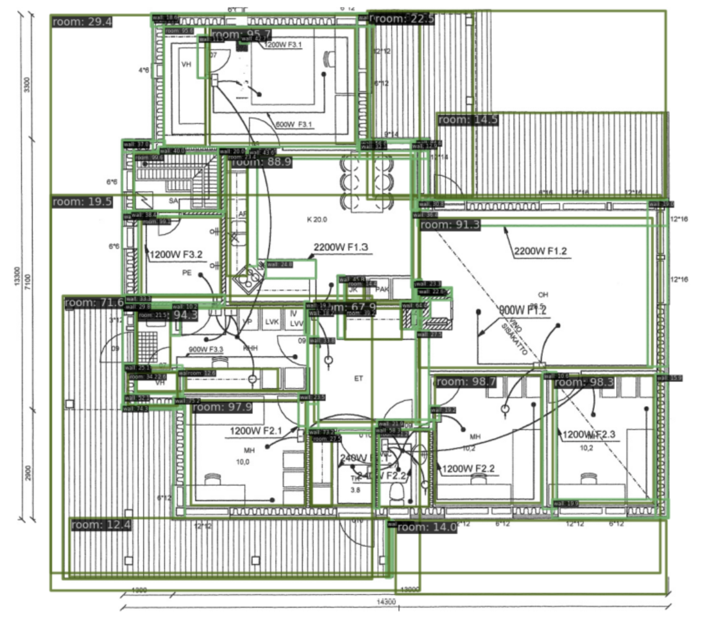

# ✅ FloorPlan Detection (Complete)


[](https://www.kaggle.com/code/qmarva/cubicasa5k-swin-transformer-mmdetection)

⚠️ Disclaimer: This test project was completed for a startup with a highly unprofessional hiring process. In hindsight, it was a mistake to invest so much time in a company that didn’t bother with a basic initial screening before assigning a multi-day take-home task. They were not transparent about the compensation details listed on Wellfound and ultimately ghosted me at the final stage, despite having agreed to move forward. They also spoke disrespectfully about their previous ML Engineer.


## Overview

This repository contains the API code for detecting walls and rooms in architectural floor plans. 
I’m also sharing my notebooks, research results, and some thoughts on how the results could be improved.

## 🚀 How to run

### 1. Model Weights
Download the  [pre-trained model weights](https://drive.google.com/drive/folders/1MgW3Qo-8K4OrHi4ebvYd-81cTqQxwLgz?usp=sharing) and place them in the `/models` directory. You can adjust model types by specifying them when running the server.

### 2. Build with Docker
I used Kaggle to experiment, so the image weighs a gazillion (no, seriously, 66) gb. If I don't forget, I'll rebuild a lighter image.

To build the code environment, use the provided Dockerfile in the root directory::

`docker build -t floorplan-detection . -f Dockerfile`

Please don't forget to clean up with:

`docker system prune`

Then, use this command to run the container:

`docker run -it --rm --gpus all -p 5000:5000 florplan_detection:latest bash`

### 3. Start the Server
To start the FastAPI server, use the following command:

`python run.py --model <model_name>`

The model I prefer for this task is `cascade_swin`.

### 4. API Request

I assume that the API input is an image with a region of interest containing only the architectural plan:

```shell
curl -X POST "http://localhost:5000/run-inference" \
     -H "Content-Type: multipart/form-data" \
     -F "image=@/path/to/your/image.jpg"
```

The API will return a JSON response with both detected walls and rooms.

```json
{
  "type": "floor_plan",
  "confidence": 0.8851,
  "detectionResults": {
    "walls": [
      {
        "id": "wall_1",
        "position": {
          "start": {"x": 10.5, "y": 20.3},
          "end": {"x": 110.2, "y": 20.3}
        },
        "confidence": 0.9234
      },
      ...
    ],
    "rooms": [
      {
        "id": "room_1",
        "position": {
          "start": {"x": 20.3, "y": 25.7},
          "end": {"x": 105.6, "y": 125.9}
        },
        "confidence": 0.8352
      },
      ...
    ]
  }
}
```

## ℹ️ About

### First things first
The task doesn’t come with labeled data or evaluation criteria, so I treated it as an open-ended project. The provided floor plan examples are inconsistent—using different labels, line thicknesses, and so on—so I figured neural network-based methods would be the best approach here.

### Dataset
I’m using the `CubiCasa5k` dataset. This dataset provides annotations for different room types, but I’m focusing on two categories: Walls and Rooms (without further subclassification). The dataset initially comes with masks, but I use only bboxes. I’ve converted it to `COCO` format for smoother integration with detection framework. 

- If you want to use [original dataset](https://zenodo.org/records/2613548), you need to download it and put into `data/CubiCasa5k/data` directory. For a quick overview of the dataset, check out the notebook: `/notebooks/cubicasa5k_dataset.ipynb`
- If you want to use my [CubiCasa5k_COCO](https://drive.google.com/drive/folders/1hKRWrP-ZKk6ZHrjHOSRSxPe_r_kMd8uh?usp=sharing) dataset of train another model on it, you need to download it and puth into `data/cubicasa5k_coco` directory. You still need images in `data/CubiCasa5k/data`.
- If you want to modify original data to coco format (with masks or anything else) you can use `notebooks/cubicasa5k_to_coco.ipynb` script.

### Models

When you run server you should pass `--model` argument. 

The recommended model is Swin Transformer Cascade R-CNN, it goes as `cascade_swin`. 


This model uses a cascade of detectors that refine predictions step-by-step, making localization more precise. I use ResNet-101 as its backbone, so the model gets deep and detailed features from images, while staying efficient. The Feature Pyramid Network (FPN) helps spot objects of all sizes.

Supported models are:
- `cascade_swin`
- `faster_rcnn`
- `retinanet`

You need download [model weights](https://drive.google.com/drive/folders/1MgW3Qo-8K4OrHi4ebvYd-81cTqQxwLgz?usp=sharing) and put into `weights/` folder.


### Research

- [x] DeepFloorPlan - `/notebooks/deepfloorplan_model.ipynb`
- [ ] SAM Baseline - `/notebooks/sam_baseline.ipynb`

### Notebooks

- [x] CubiCasa5k Dataset - `/notebooks/cubicasa5k_to_coco.ipynb`
- [x] Inference and Visualization - `/notebooks/inference_and visualization.ipynb`

### Train model

To train another mmdetection architecture for this task, you need to create config file for this model and put it into `/configs` directory.

```shell
python mmdetection/tools/train.py configs/[custom_model_config].py
```

### Examples

Example of inference on a test image from the CubiCasa5k dataset:



Example of inference on part of the image from the demonstrated pdf samples:


